# Let's Build a Movie Search Engine Using Full Text Search Indexes in Minutes!

Giving your users the ability to find exactly what they are looking for in your application is critical for a fantastic user experience. With MongoDB Atlas’s new Full-Text Search feature, we have made it easier than ever to integrate simple yet sophisticated search capabilities into your MongoDB applications. To demonstrate just how easy it is, let’s build a movie search engine - in only 10 minutes.

Built on Apache Lucene, Atlas’ Full-Text Search adds document data to a full-text search index to make that data searchable in a highly performant, scalable manner. This tutorial will guide you through how to build a web application to search for movies based on a topic using Atlas’ sample movie data collection. We will create an FTS index on that sample data. Then we will query on this index to filter, rank and sort through those movies to quickly surface movies by topic.

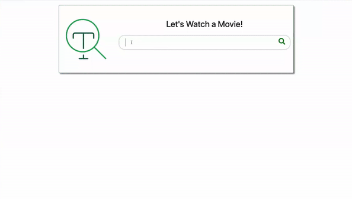

Armed with a basic knowledge of HTML and Javascript, here are the tasks we will accomplish:

**▢ Spin up an Atlas cluster and load sample movie data**

**▢ Create a Full-Text Search Index in movie data collection**

**▢ [Write an aggregation pipeline with $searchBeta operator](#bookmark=kix.kcnkw5ov8zkj)**

**▢ [Create a RESTful API to access data](#bookmark=kix.s5ejsz11gvzf)**

**▢ [Call from the front end](#bookmark=kix.izktwtqq24ey)**

Now break out the popcorn, and get ready to find that movie that has been sitting on the tip of your tongue for weeks.


To **Get Started**, we will need:

1. A MongoDB M30 cluster in Atlas running 4.2. Navigate to cloud.mongodb.com and sign in to **Build a New Cluster.** *(This is a temporary minimum setting while Full-Text Search is still in beta. We do have plans to expand FTS to more cluster sizes in the future.)*

<table>
  <tr>
    <td>SPECIAL OFFER:
Want to try our Full-Text Search on a cluster of your own? http://bit.ly/serverlessATX for $200 of Atlas credit. For information on redeeming Atlas credit, see Atlas Billing.</td>
  </tr>
</table>


2. Atlas Sample Data loaded into the Atlas cluster directly from the Atlas UI. You can get this by clicking the  button and **Load Sample Dataset**.

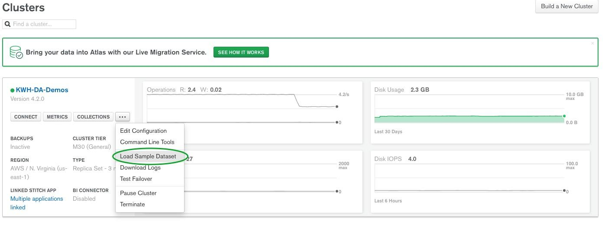

*For more detailed information on how to spin up a cluster, configure your IP address, create a user, and load sample data, check out **[Getting Started with MongoDB Atlas.** (https://docs.atlas.mongodb.com/getting-started/#atlas-getting-started) from our documentation.*

3. (Optional) MongoDB Compass - the latest version can be found here [https://www.mongodb.com/download-center/compass](https://www.mongodb.com/download-center/compass)

Now you have data in a database, let’s have a closer look to see what we are working with Atlas Data Explorer. In your Atlas UI, click on the Collection tab to examine your movies collection in your new `sample_mflix` database. This collection has over 23k movie documents with information such as title, plot, and cast.

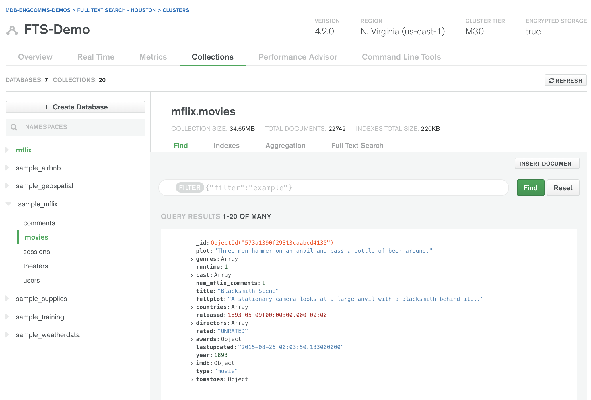

**✅** **Spin up an Atlas cluster and load sample movie data**

**▢ Create a Full-Text Search Index in movie data collection**

**▢ [Write an aggregation pipeline with $searchBeta operator](#bookmark=kix.kcnkw5ov8zkj)**

**▢ [Create a RESTful API to access data](#bookmark=kix.s5ejsz11gvzf)**

**▢ [Call from the front end](#bookmark=kix.izktwtqq24ey)**

### **CREATE A FULL-TEXT SEARCH INDEX**

Our movie search engine is going to look for movies based on a topic. We will use Full-Text search to query for specific words and phrases in the documents’ ‘fullplot’ field.

The first thing we need is a Full-Text Search Index. The top right tab is titled "Full Text Search." Clicking on  will bring you here:


By default, we dynamically map all the text fields in your collection. This suits MongoDB’s flexible data model perfectly. As you add new data to your collection and your schema evolves, dynamic mapping accommodates those changes in your schema and adds that new data to the FTS index automatically.

Let’s accept the default settings and click **Create Index.** That’s all you need to do to start taking advantage of Lucene in your MongoDB Atlas data! 👊

**✅ Spin up Atlas cluster and load sample movie data**

**✅ Create a Full-Text Search Index in movie data collection**

**▢ Write aggregation pipeline with $searchBeta operator**

**▢ Create a RESTful API to access data**

**▢ Call from the front end**

### **WRITE AGGREGATION PIPELINE WITH $SEARCHBETA OPERATOR**

Full-Text Search Queries take the form of an aggregation pipeline stage.  The **$searchBeta** stage performs a full-text search on the specified field or fields covered by the FTS index, and it must be used as the first stage in the aggregation pipeline. Now let’s use MongoDB Compass to see an aggregation pipeline that makes use of this Full-Text Search Index.

*You do not have to use Compass for this stage, but I really love the easy-to-use UI Compass has to offer. Plus the ability to preview the results by stage makes troubleshooting a snap! For more on Compass’ Aggregation Pipeline Builder, check out this **[blog.](https://www.mongodb.com/blog/post/introducing-the-aggregation-pipeline-builder-in-mongodb-compass)**

Navigate to the Aggregations tab in the sample_mflix.movies collection:

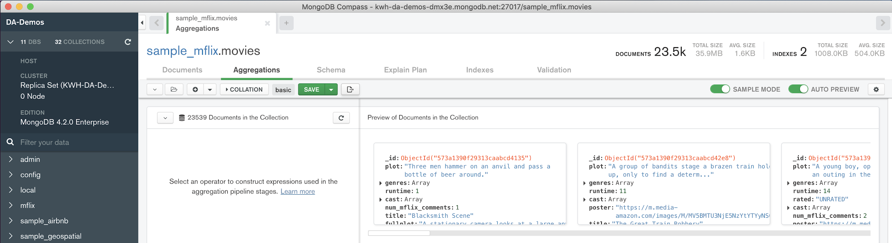

**Stage 1: $searchBeta**


For the first stage, select the **$searchBeta** aggregation operator to search for the terms ‘werewolves and vampires’ in the ‘fullplot’ field.


Using the **highlight option** will return the highlights by adding fields to the result that display search terms in their original context, along with the adjacent text content. (More on this later.)


**Note the returned movie documents in the preview panel on the right. If no documents are in the panel, double check the formatting in your aggregation code.**

**Stage 2: $project**

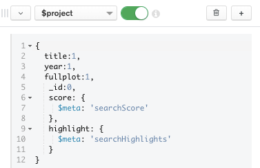

We use **$project** to get back only the fields we will use in our movie search application. We also use the **$meta** operator to surface each document’s **searchScore** and **searchHighlights** in the result set.

**SCORE:** The **"$meta": "searchScore"** contains the assigned score for the document based on relevance. This signifies how well this movie’s ‘fullplot’ field matches the query terms ‘werewolves and vampires’ above.

Note by scrolling in the right preview panel that the movie documents are returned with the score in descending order which provides the best matches first.

**HIGHLIGHT:** The **"$meta": "searchHighlights"** contains the highlighted results.

**Because ***_searchHighlights _***and***_ searchScore_*** are not part of the original document, it is necessary to use a ***_$project_*** pipeline stage to add them to the query output.*

Now open a document’s **highlight** array to show the data objects with text **values** and **types**.
```javascript
{
  "title": "The Mortal Instruments: City of Bones"
  "fullplot": "Set in contemporary New York City, a seemingly ordinary teenager, Clar..."
  "year": 2013
  "score": 6.849891185760498
  "highlight": Array
  0: Object
  path: "fullplot"
  texts: Array
  0: Object
  value: "After the disappearance of her mother, Clary must join forces with a g..."
  type: "text"
  1: Object
  value: "vampires"
  type: "hit"
  2: Object
  3: Object
  4: Object
  5: Object
  6: Object
  score: 3.556248188018799</td>
}
```


**highlight.texts.value** - text from the ‘fullplot’ field which returned a match.

**highlight.texts.type** -  either a hit or a text. A **hit** is a match for the query, whereas a **text**** **is text content adjacent to the matching string. We will use these later in our application code.

**Stage 3: $limit**

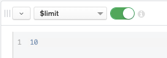

Remember the results are returned with the scores in descending order, so **$limit: 10** will bring the 10 most relevant movie documents to your Full-Text search.

Finally, if you see results in the right preview panel, your aggregation pipeline is working properly! Let’s grab that aggregation code with Compass’ Export Pipeline to Language feature by clicking the 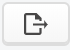 button in the top toolbar.

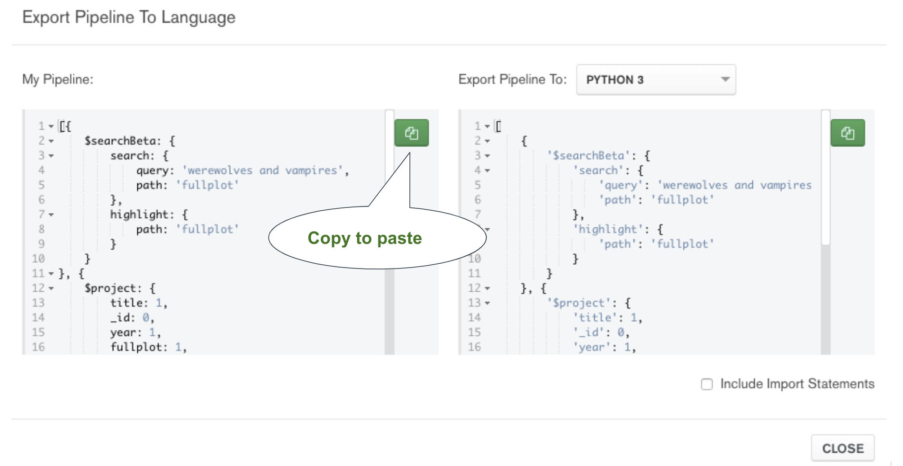

Your final aggregation code will be this:

```javascript
[
  { $searchBeta: {
      search: {
        query: 'werewolves and vampires',
        path: 'fullplot' },
     highlight: {  path: 'fullplot’ }
       }},
   { $project: {
      title: 1,
      _id: 0,
      year: 1,
      fullplot: 1,
      score: { $meta: 'searchScore' },
      highlight: { $meta: 'searchHighlights' }
                }},
    { $limit: 10 }
]
```


**This small snippet of code powers our movie search application! 💪**

**✅ Spin up Atlas cluster and load sample movie data**

**✅ Create an FTS Index in movie data collection**

**✅ Write aggregation pipeline with $searchBeta operator**

**▢ Create a RESTful API to access data**

**▢ Call from the front end**

### **CREATE A REST API**

Now that we have the heart of our movie search engine in the form of an aggregation pipeline, how will we use it in an application? There are lots of ways to do this, but I found the easiest was to simply create a RESTful API to expose this data - and for that I used MongoDB Stitch’s HTTP Service.

Stitch is MongoDB’s serverless platform where functions written in Javascript automatically scale to meet current demand. To create a Stitch application, return to your Atlas UI and click **Stitch** under SERVICES on the left menu. Then click


Name the Stitch application FTSDemo. Make sure to link to your 4.2 cluster. All other default settings are fine:


Now click the **Services** menu on the left and then **Add a Service**.

Select the HTTP service and name it **movies**:

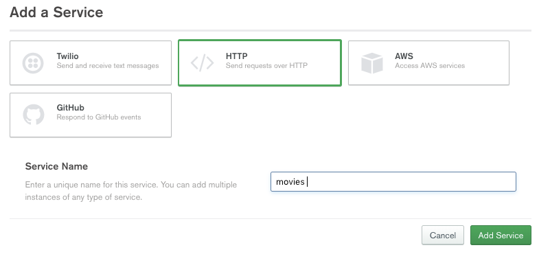

Click . Then you’ll be directed to**. **

Enable **Respond with Result**, set the HTTP Method to **GET**, and to make things simple, let’s just run the webhook as the System and skip validation.


In this service function editor, replace the example code with the following:

```javascript
{
  exports = function(payload) {
    const collection =             context.services.get("mongodb-atlas").db("sample_mflix").collection("movies");
    let arg = payload.query.arg;
    return collection.aggregate([
        { $searchBeta: {
                       search: {
                          query: arg,
                          path:'fullplot',
                        },
                        highlight: { path: 'fullplot' }
                }},
                { $project: {
                       title: 1,
                       _id:0,
                       year:1,
                       fullplot:1,
                       score: { $meta: 'searchScore'},
                       highlight: {$meta: 'searchHighlights'}
                }},
                { $limit: 10}
        ]).toArray();
}
```

MongoDB Stitch interacts with your Atlas movies collection through the global **context** variable. In the service function, we use that context variable to access the sample_mflix.movies collection in your Atlas cluster:

<table>
  <tr>
    <td>const collection = context.services.get("mongodb-atlas").db("sample_mflix").collection("movies");</td>
  </tr>
</table>


 We capture the query argument from the payload:

<table>
  <tr>
    <td>let arg = payload.query.arg;</td>
  </tr>
</table>


Return the aggregation code executed on the collection by pasting your aggregation into the code below:

<table>
  <tr>
    <td> return collection.aggregate(**<PASTE AGGREGATION PIPELINE HERE>**).toArray();</td>
  </tr>
</table>


Finally, after pasting the aggregation code, we changed the terms ‘werewolves and vampires’ to the generic **arg ** to match the function’s payload query argument - otherwise our movie search engine capabilities will be extremely limited. 


Now you can **test in the Console** below the editor by changing the argument from **arg1: "Hello"** to **arg****: “werewolves and vampires”**.


Click **Run **to verify the result:


If this is working, congrats! We are almost done! Make sure to **SAVE** and deploy the service by clicking **REVIEW & DEPLOY CHANGES** at the top of the screen.


### **Use the API**

The beauty of a REST API is that it can be called from just about anywhere. Let’s execute it in our browser. However, if you have tools like [Postman](https://www.getpostman.com/) installed, feel free to try that as well.

Switch to the **Settings** tab of the **movies** service and you’ll notice a Webhook URL has been generated.

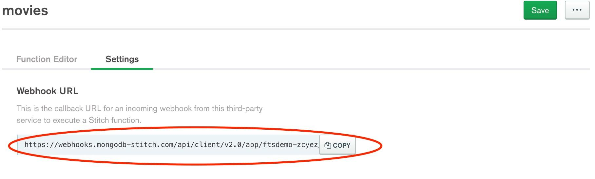

Click the **COPY** button and paste the URL into your browser. Then append the following to the end of your URL: **?arg=’werewolves and vampires’**

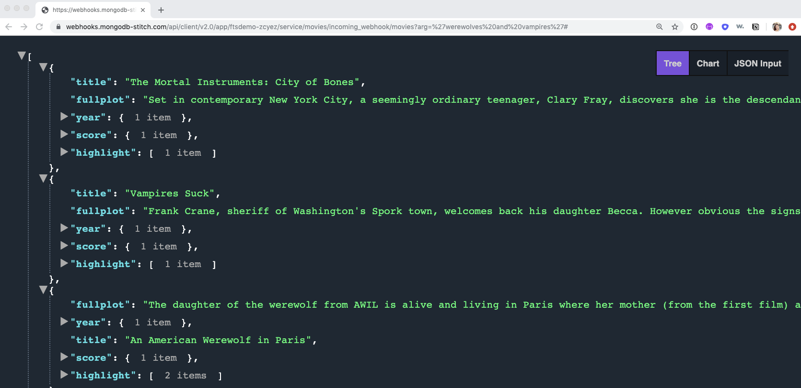

<table>
  <tr>
    <td>If you receive an output like what we have above, congratulations! You have successfully created a movie search API!</td>
    <td></td>
  </tr>
</table>


**✅ Spin up Atlas cluster and load sample movie data**

**✅ Create a Full-Text Search Index in movie data collection**

**✅ Write aggregation pipeline with $searchBeta operator**

**✅ Create a RESTful API to access data**

**▢ Call from the front end**


### **FINALLY! - THE FRONT END**

From the front end application, it takes a single call from the Fetch API to retrieve this data. Download the following[ index.html file](http://bit.ly/MDB_FTS_MovieSearch)  and open in your browser. You will see a simple search bar:


Entering data in the search bar will bring you movie search results because the application is currently pointing to an existing API.

Now open the html file with your favorite text editor and familiarize yourself with the contents. You’ll note the **<body>** contains a very simple container and 2 javascript functions:

* Line 82 **- userAction()** will execute when the user enters a search. If there is valid input in the search box and no errors, we will call the **buildMovieList()** function.

* Line 125 -** buildMovieList()** is a helper function for **userAction()** which will build out the list of movies, along with their scores and highlights from the fullplot field. Notice in line 146 that if the **highlight.texts.type === "hit"** we highlight the **highlight.texts.value** with the **<mark>** tag.

### **Modify the Front End Code to Use Your API**

In the **userAction() **function, we grab the input from the search form in line 83 and append it to the webhook URL before calling the fetch API in line 92.  My data webhook URL from the FTSDemo Stitch application is on line 88. Replace that **webhook_url** variable with your own API from your Stitch HTTP Service. 🤞

Now save these changes, and open the** index.html** file once more in your browser et voilà! You have just built your movie search engine using Full-Text search indexes. 🙌 What kind of movie do you want to watch?!


**THAT’S A WRAP!**

Now that you have just seen how easy it is to build a simple, powerful search into an application with MongoDB’s new Full-Text Search Indexes, go ahead and experiment with other more advanced features, such as type-ahead or fuzzy matching, for your fine-grained searches. Check out our **[$searchBeta** ](https://docs.atlas.mongodb.com/reference/full-text-search/query-syntax/)documentation for other possibilities.


Harnessing the power of Apache Lucene for efficient search algorithms, static and dynamic field mapping  for flexible, scalable indexing, all while using the same MongoDB Query Language (MQL) you already know and love, *[*spoken in our very best Liam Neeson impression**](https://youtu.be/jZOywn1qArI) MongoDB now has a very particular set of skills. Skills we have acquired over a very long career. Skills that make MongoDB a DREAM for developers like you.
